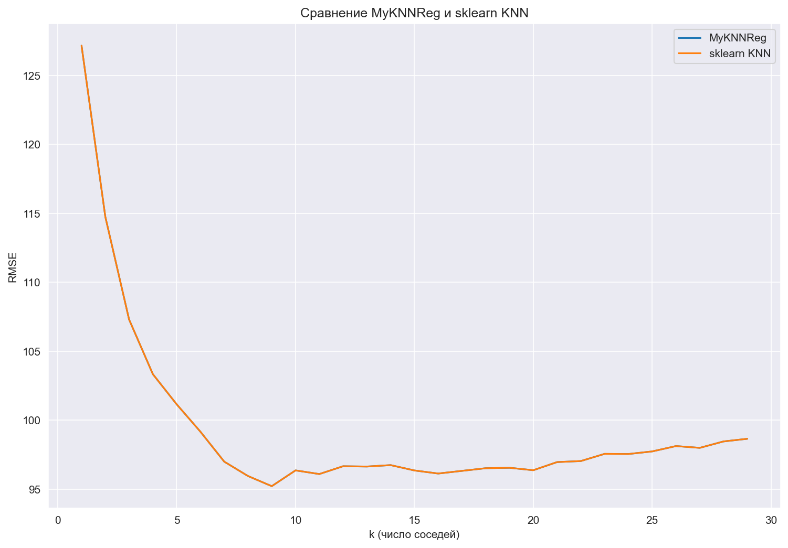
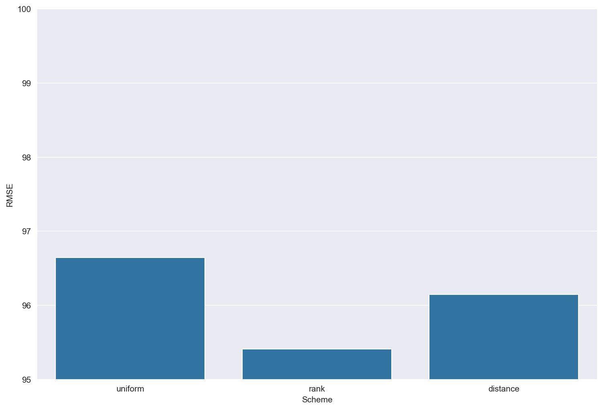
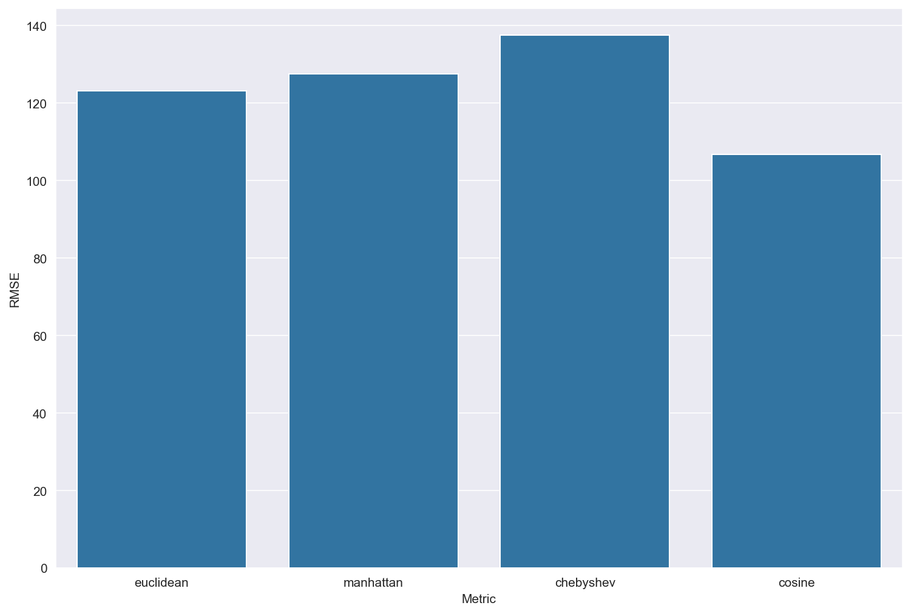

# Проект: Реализация KNN-регрессии с нуля (MyKNNReg)

## Введение

Проект реализует алгоритм **k-ближайших соседей для регрессии (k-Nearest Neighbors Regression, KNN Regression)** на Python без использования готовых библиотек машинного обучения.

Особенности реализации:

* Поддержка нескольких метрик расстояния: **евклидова, манхэттенская, Чебышева, косинусная**
* Разные схемы взвешивания соседей: **uniform, rank, distance**
* Возможность предсказания вещественных значений как усреднением, так и с учётом весов
* Простая и наглядная структура кода для изучения работы алгоритма

**Цель проекта:** изучение принципов работы алгоритма KNN-регрессии и его реализация с нуля.
**Актуальность:** KNN-регрессия используется как базовый метод прогнозирования, позволяющий быстро получить рабочее решение и часто служит отправной точкой в анализе данных.

---

## Теоретическая часть

### Модель KNN-регрессии

Принцип работы алгоритма:

1. Для объекта \$x\$ находятся **k ближайших соседей** из обучающей выборки.
2. Значение целевой переменной предсказывается как **усреднённое значение соседей** либо с учётом весов.
3. Веса могут задаваться разными способами:

   * Равные веса (**uniform**)
   * Убывание по рангу (**rank**)
   * Обратная зависимость от расстояния (**distance**)

---

## Реализация (MyKNNReg)

Класс `MyKNNReg` поддерживает следующие параметры:

| Параметр | Тип | Описание                                                             |
| -------- | --- | -------------------------------------------------------------------- |
| k        | int | Количество ближайших соседей                                         |
| metric   | str | Метрика расстояния (`euclidean`, `manhattan`, `chebyshev`, `cosine`) |
| weight   | str | Схема взвешивания (`uniform`, `rank`, `distance`)                    |

---

## Подбор оптимального количества соседей

При изменении числа соседей качество предсказания меняется. Обычно малые значения k чувствительны к шуму, а большие сглаживают данные, что снижает влияние выбросов, но может ухудшать локальную точность.

---

## Сравнение весовых схем

| Схема весов  | Принцип                                  | Особенности                                      |
| ------------ | ---------------------------------------- | ------------------------------------------------ |
| **uniform**  | Все соседи равны                         | Простой вариант, подходит при равномерных данных |
| **rank**     | Вес обратно пропорционален номеру соседа | Ближайшие соседи оказывают большее влияние       |
| **distance** | Вес обратно пропорционален расстоянию    | Учитывает различия в плотности данных            |

---

## Сравнение метрик расстояния

| Метрика       | Формула                                                     | Применимость                                      |
| ------------- | ----------------------------------------------------------- | ------------------------------------------------- |
| Евклидова     | \$\sqrt{\sum\_i (x\_i - y\_i)^2}\$                          | Подходит для большинства задач                    |
| Манхэттенская | \$\sum\_i \Vert x\_i - y\_i \Vert\$                         | Устойчива к выбросам                              |
| Чебышева      | \$\max\_i \Vert x\_i - y\_i \Vert\$                         | Учитывает только наибольшую разницу               |
| Косинусная    | \$1 - \frac{x \cdot y}{\Vert x \Vert \cdot \Vert y \Vert}\$ | Используется для текстов и высокоразмерных данных |

